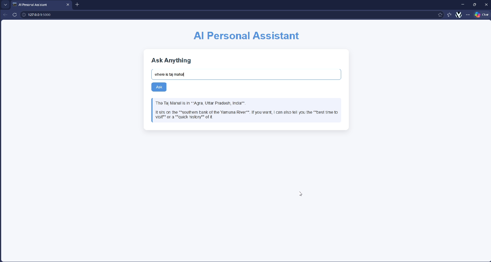

# AI_Assistent
AI-powered chatbot web application built with Python, Flask, and OpenAI API. Users can ask questions through a simple web interface, and the app generates intelligent responses in real time using GPT models. Includes frontend integration, API handling, environment variable security, and backend deployment-ready structure.

